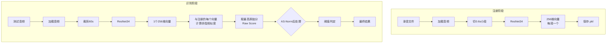

以下是一份关于在 WeSpeaker 中配置和使用 **AS-Norm（自适应得分归一化）** 的详细技术文档，已整理为 Markdown 格式。你可以直接复制保存为 `.md` 文件。

```markdown
# WeSpeaker 中 AS-Norm 的配置与使用指南

本指南面向 Voice ID 初学者，详细说明 AS-Norm（自适应得分归一化）在整个声纹识别流程中的位置、作用原理，以及在 WeSpeaker 工程中的具体配置方法。

---

## 1. 整体流程回顾（含 AS-Norm 位置）

下图展示了从注册到识别的完整流程，并标出了 AS-Norm 介入的环节：



> **AS-Norm 并不改变向量本身**，仅作为“分数校准器”作用于相似度计算之后、阈值判决之前。

---

## 2. AS-Norm 的核心原理（小白版）

AS-Norm 通过引入一个**与任务无关的冒认者语音集**，来修正原始相似度分数，消除因测试环境、口音、信道等因素造成的分数波动。

### 2.1 三步走

1. **准备冒认集**：一批不包含目标说话人的语音，覆盖与真实场景相近的性别、信道、语言。
2. **计算参照统计量**：
   - 对注册语音：计算它与冒认集中**最相似的 Top‑K 个人**的相似度，并求均值 `μ_enroll` 和标准差 `σ_enroll`。
   - 对测试语音：同样计算它与冒认集中 **Top‑K 个人**的相似度，得到 `μ_test` 和 `σ_test`。
3. **校准原始分**：  
   `AS‑Norm 分数 = 0.5 × (raw - μ_enroll)/σ_enroll + 0.5 × (raw - μ_test)/σ_test`

### 2.2 为什么有效？

- **去除“易混淆”背景**：如果某个测试语音本身就和很多冒认者很像，它的原始分会被大幅拉低，避免误判。
- **让不同说话人的分数分布对齐**：校准后可以使用一个全局阈值，而无需为每个说话人单独调参。
- **显著降低等错误率（EER）与最小检测代价（minDCF）**。

---

## 3. WeSpeaker 中的配置步骤

WeSpeaker 支持在推理（打分）阶段开启 AS-Norm。通常通过修改配置文件或命令行参数实现。

### 3.1 准备冒认数据集

你需要一个 **Cohort Set**（冒认集），可以是：
- 公开数据集（如 VoxCeleb2 的一部分，不包含你注册的目标人）
- 你自己收集的、与目标域相似的语音片段（每个说话人一条即可）

**建议格式**：与训练/注册数据相同的 wav 文件列表，存为一个文本文件，每行是语音的绝对路径。

### 3.2 修改配置文件（以 `conf/resnet34.yaml` 为例）

找到与打分相关的配置段（通常在 `score_norm` 或 `evaluation` 下），添加或修改以下参数：

```yaml
# 启用分数归一化
score_norm: asnorm   # 可选：none, asnorm, tnorm, znorm

# AS-Norm 专用参数
asnorm:
  # 冒认集音频列表文件（每行一条音频路径）
  cohort_file: "data/cohort_list.txt"
  
  # 提取冒认集向量时使用的模型（通常与注册/识别模型相同）
  cohort_model_path: "exp/resnet34/model.pt"
  
  # 相似度计算时选取的 Top‑K 冒认者数量
  top_k: 300
  
  # 是否对注册部分做 znorm（通常 asnorm 已包含，保留 true）
  use_znorm: true
  
  # 是否对测试部分做 tnorm（通常 asnorm 已包含，保留 true）
  use_tnorm: true
```

> **注意**：不同版本的 WeSpeaker 参数名可能略有差异，请以你所用版本的 `scores/norm_ops.py` 或 `bin/score_norm.py` 中的接口为准。

### 3.3 使用命令行方式（无需修改 yaml）

如果你习惯用命令行打分，可以调用 `wespeaker/bin/score_norm.py`：

```bash
python wespeaker/bin/score_norm.py \
    --enroll_data data/enroll.pkl \          # 注册向量文件
    --test_data data/test.pkl \              # 测试向量文件
    --cohort_data data/cohort_list.txt \     # 冒认集音频列表
    --model_path exp/resnet34/model.pt \     # 用于提取 cohort 向量的模型
    --score_norm asnorm \
    --top_k 300 \
    --output_scores scores_asnorm.txt
```

> 如果尚未提取冒认集的向量，WeSpeaker 会在首次运行时自动提取并缓存为 `.pkl` 文件。

---

## 4. 关键参数详解

| 参数 | 含义 | 建议值 | 注意事项 |
|------|------|--------|-----------|
| `top_k` | 用于计算均值/标准差的最相似冒认者数量 | 300~500 | 太小则统计不稳定，太大则引入噪声。通常取冒认集总人数的 5%~10% |
| `cohort_file` | 冒认集音频列表 | 建议 2000~10000 条 | 需要**保证与目标说话人无重叠**，且男女比例、信道分布尽量贴近使用场景 |
| `use_znorm` / `use_tnorm` | 是否启用注册端/测试端归一化 | 一般同时为 true | 两者都启用才是完整的 AS‑Norm |

---

## 5. 冒认数据集准备建议

### 5.1 如何构建一个好的冒认集？

- **大小**：至少 2000 条语音（来自不同的说话人），5000 条以上效果更稳定。
- **来源**：最好来自你的真实场景（例如客服热线语音），且不包含任何注册或测试说话人。
- **长度**：每条语音建议 3~10 秒，与注册语音片段长度（0.6s 若干段）可不同，但使用相同的特征提取方式。
- **多样性**：包含不同性别、年龄、口音、录音设备、背景噪声。

### 5.2 快速创建示例

假设你已有一些未参与注册的语音文件，放在 `data/cohort_audio/` 下：

```bash
find data/cohort_audio -name "*.wav" > data/cohort_list.txt
```

### 5.3 提取冒认集向量（可选手动提前执行）

```bash
python wespeaker/bin/extract_embeddings.py \
    --model_path exp/resnet34/model.pt \
    --data_list data/cohort_list.txt \
    --output_path data/cohort_embeddings.pkl
```

然后在 `score_norm` 配置中通过 `--cohort_embedding data/cohort_embeddings.pkl` 直接使用，避免每次重复提取。

---

## 6. 常见问题与排查

### Q1：开启 AS‑Norm 后分数范围变化很大，甚至出现负数，正常吗？
**A**：完全正常。AS‑Norm 输出的是 Z‑Score 形式（表示偏离均值的标准差倍数），阈值也需要重新调整。建议在新的分数上重新计算 EER 或使用自适应阈值。

### Q2：我的任务中冒认集很难获取，怎么办？
**A**：可以使用公开数据集（如 VoxCeleb1 的开发集部分），确保其中不包含你的目标说话人即可。或者使用“通用背景模型”的思想，从一个大型语料库中随机抽取子集。

### Q3：Top‑K 应该怎么选最优？
**A**：没有固定值。一般做法是在开发集上遍历 K = 100, 200, 300, 500，观察等错误率（EER）最低时的 K 值。WeSpeaker 的 `bin/score_norm.py` 支持自动搜索最佳 K（需额外参数）。

### Q4：AS‑Norm 会大幅增加计算耗时吗？
**A**：会增加，但可控。主要开销在于计算测试语音与所有冒认者的相似度（O(N_cohort)）。可以提前缓存冒认集向量，并利用 GPU 批处理加速。对于数千级别的冒认集，额外耗时通常在秒级以内。

---

## 7. 总结

- **AS‑Norm 是声纹识别系统中提升鲁棒性的重要利器**，尤其适合跨信道、跨场景的识别任务。
- 在 WeSpeaker 中，你只需准备一个冒认语音集，并在打分配置中开启 `asnorm` 即可。
- 参数 `top_k` 和冒认集的质量对最终效果影响显著，建议在开发集上仔细调优。

如果你在具体操作中遇到任何问题，欢迎查阅 WeSpeaker 官方文档或提交 GitHub Issue。

---
*文档版本：1.0*  
*适用 WeSpeaker 版本：v1.0+*
```

你可以按需调整其中的路径、参数名称，或者补充你自己的实验数据。如果有特定版本差异或其他需求，请告诉我。