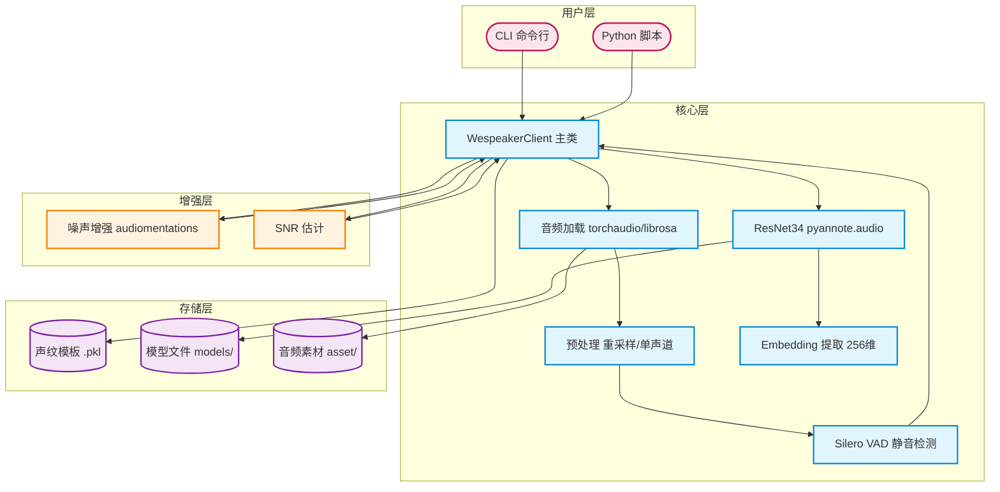

# 系统总体架构图 (System Architecture Diagram)

```mermaid
graph TB
    classDef core fill:#e1f5fe,stroke:#0288d1,stroke-width:2px;
    classDef storage fill:#f3e5f5,stroke:#7b1fa2,stroke-width:2px;
    classDef external fill:#fff3e0,stroke:#f57c00,stroke-width:2px;
    classDef gateway fill:#e8f5e9,stroke:#388e3c,stroke-width:2px;
    classDef client fill:#fce4ec,stroke:#c2185b,stroke-width:2px;

    subgraph 用户层
        CLI([CLI 命令行]):::client
        Script([Python 脚本]):::client
    end

    subgraph 核心层
        Loader[音频加载 torchaudio/librosa]:::core
        Preprocess[预处理 重采样/单声道]:::core
        VAD[Silero VAD 静音检测]:::core
        Client[WespeakerClient 主类]:::core
        Model[ResNet34 pyannote.audio]:::core
        Embed[Embedding 提取 256维]:::core
    end

    subgraph 增强层
        Augment[噪声增强 audiomentations]:::external
        SNR[SNR 估计]:::external
    end

    subgraph 存储层
        Pkl[(声纹模板 .pkl)]:::storage
        ModelFile[(模型文件 models/)]:::storage
        Asset[(音频素材 asset/)]:::storage
    end

    CLI --> Client
    Script --> Client
    Client --> Loader
    Loader --> Preprocess
    Preprocess --> VAD
    VAD --> Client
    Client --> Model
    Model --> Embed
    Client --> Augment
    Client --> SNR
    Augment --> Client
    SNR --> Client
    Client --> Pkl
    Model --> ModelFile
    Loader --> Asset
```
