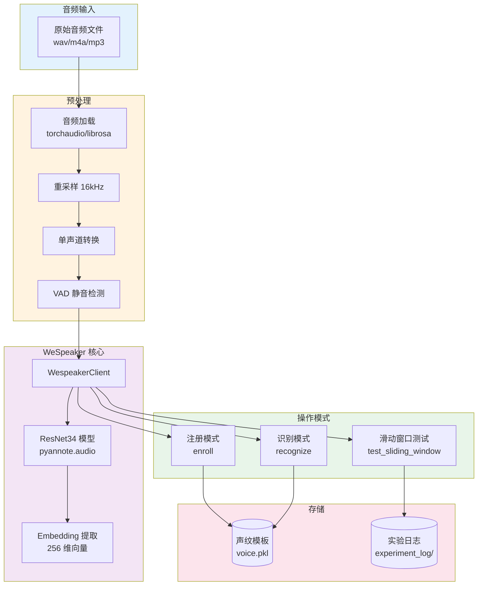

# 系统总体架构图

```mermaid
graph TB
    subgraph Input["音频输入"]
        A[原始音频文件<br/>wav/m4a/mp3]
    end

    subgraph Preprocess["预处理"]
        B[音频加载<br/>torchaudio/librosa]
        C[重采样 16kHz]
        D[单声道转换]
        E[VAD 静音检测]
    end

    subgraph Core["WeSpeaker 核心"]
        F[WespeakerClient]
        G[ResNet34 模型<br/>pyannote.audio]
        H[Embedding 提取<br/>256 维向量]
    end

    subgraph Operation["操作模式"]
        I[注册模式<br/>enroll]
        J[识别模式<br/>recognize]
        K[滑动窗口测试<br/>test_sliding_window]
    end

    subgraph Storage["存储"]
        L[(声纹模板<br/>voice.pkl)]
        M[(实验日志<br/>experiment_log/)]
    end

    A --> B --> C --> D --> E --> F
    F --> G --> H
    F --> I --> L
    F --> J --> L
    F --> K --> M

    style Input fill:#e3f2fd
    style Preprocess fill:#fff3e0
    style Core fill:#f3e5f5
    style Operation fill:#e8f5e9
    style Storage fill:#fce4ec
```
