# 数据流图 (Data Flow Diagram)

## 最佳配置参数

| 参数 | 值 | 说明 |
|------|------|------|
| **sim_threshold** | 0.55 | 识别阈值，基于动态阈值分析确定 |
| **verify_crop_mode** | full_utterance | 使用完整音频，不裁剪 |
| **verify_buffer_keep_secs** | 60.0 | 不截断，使用完整音频 |
| **enable_vad** | False | 完整音频得分高于 VAD 去静音 |
| **vad_rms_threshold** | 0.002 | RMS VAD 能量阈值（已降低减少误剪） |
| **sample_rate** | 16000 Hz | 统一采样率 |
| **SNR 级别** | 20, 15, 10, 5, 0 dB | 多级别噪声增强 |

## 数据流图

```mermaid
flowchart LR
    classDef source fill:#fce4ec,stroke:#c2185b,stroke-width:2px;
    classDef process fill:#e1f5fe,stroke:#0288d1,stroke-width:2px;
    classDef store fill:#f3e5f5,stroke:#7b1fa2,stroke-width:2px;
    classDef output fill:#e8f5e9,stroke:#388e3c,stroke-width:2px;
    classDef external fill:#fff3e0,stroke:#f57c00,stroke-width:2px;
    classDef config fill:#e0e0e0,stroke:#616161,stroke-width:2px,stroke-dasharray: 5 5;

    Config[("配置参数:<br/>sim_threshold: 0.55<br/>enable_vad: False<br/>vad_rms_threshold: 0.002<br/>sample_rate: 16kHz")]:::config

    subgraph 注册流程
        RegAudio([注册音频 .wav/.m4a]):::source
        RegLoad["音频加载<br/>sample_rate: 16kHz<br/>mono: True"]:::process
        RegSplit["切分片段<br/>按静音间隔切分"]:::process
        RegFilter["过滤短片段<br/>min_duration: ≥1s"]:::process
        RegVAD["Silero VAD<br/>threshold: 0.5<br/>min_speech: 250ms<br/>min_silence: 100ms"]:::process
        RegAug["噪声增强<br/>multi-SNR: [20,15,10,5,0]dB<br/>真实噪声注入"]:::external
        RegEmb["提取 Embedding<br/>模型: pyannote.audio<br/>维度: 256"]:::process
        RegAvg["均值 + 归一化<br/>L2 norm: 1.0"]:::process
        RegSave[("保存 .pkl<br/>包含: embeddings+metadata")]:::store
        RegQM["质量评估<br/>within_class_compactness<br/>cosine_distances"]:::process

        RegAudio -->|音频数据| RegLoad
        RegLoad -->|waveform| RegSplit
        RegSplit -->|片段列表| RegFilter
        RegFilter -->|有效片段| RegVAD
        RegVAD -->|VAD处理后| RegAug
        RegAug -->|增强后片段| RegEmb
        RegEmb -->|embeddings| RegAvg
        RegAvg -->|最终向量| RegSave
        RegAvg -->|embeddings| RegQM
    end

    subgraph 识别流程
        RecAudio([测试音频]):::source
        RecLoad["音频加载<br/>sample_rate: 16kHz"]:::process
        RecCrop["裁剪窗口<br/>mode: full_utterance<br/>buffer_keep: 60s"]:::process
        RecVAD["RMS VAD<br/>threshold: 0.002<br/>可选 (enable_vad)"]:::process
        RecEmb["提取 Embedding<br/>模型: pyannote.audio"]:::process
        RecLoadPkl[("加载 .pkl<br/>参考声纹向量")]:::store
        RecSim["余弦相似度计算<br/>cosine(embed1, embed2)"]:::process
        RecDec{"分数 >= 0.55?"}:::output
        RecPass([识别成功]):::output
        RecFail([识别失败]):::output
        RecDiag["诊断信息<br/>top2_diff<br/>threshold_distance"]:::process

        RecAudio -->|音频数据| RecLoad
        RecLoad -->|waveform| RecCrop
        RecCrop -->|处理后音频| RecVAD
        RecVAD -->|VAD处理后| RecEmb
        RecEmb -->|embedding| RecSim
        RecLoadPkl -->|参考向量| RecSim
        RecSim -->|相似度分数| RecDec
        RecSim -->|所有分数| RecDiag
        RecDec -->|是| RecPass
        RecDec -->|否| RecFail
    end

    Config -.->|参数配置| RegAug
    Config -.->|参数配置| RegFilter
    Config -.->|参数配置| RegVAD
    Config -.->|参数配置| RecCrop
    Config -.->|参数配置| RecVAD
    Config -.->|参数配置| RecDec

    RegSave -.->|参考声纹| RecLoadPkl
    RegQM -.->|质量报告| RecDiag
```

