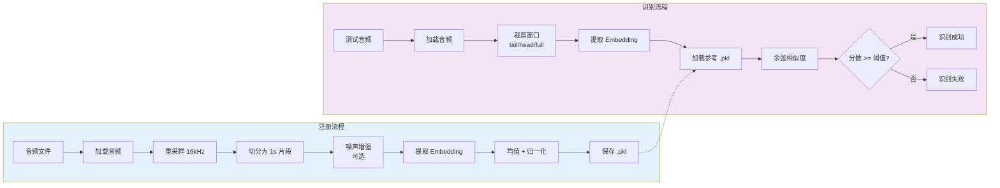

# 数据流图

```mermaid
flowchart LR
    subgraph Registration["注册流程"]
        A1[音频文件] --> A2[加载音频]
        A2 --> A3[重采样 16kHz]
        A3 --> A4[切分为 1s 片段]
        A4 --> A5[噪声增强<br/>可选]
        A5 --> A6[提取 Embedding]
        A6 --> A7[均值 + 归一化]
        A7 --> A8[保存 .pkl]
    end

    subgraph Recognition["识别流程"]
        B1[测试音频] --> B2[加载音频]
        B2 --> B3[裁剪窗口<br/>tail/head/full]
        B3 --> B4[提取 Embedding]
        B4 --> B5[加载参考 .pkl]
        B5 --> B6[余弦相似度]
        B6 --> B7{分数 >= 阈值?}
        B7 -->|是| B8[识别成功]
        B7 -->|否| B9[识别失败]
    end

    A8 -.-> B5

    style Registration fill:#e3f2fd
    style Recognition fill:#f3e5f5
```
