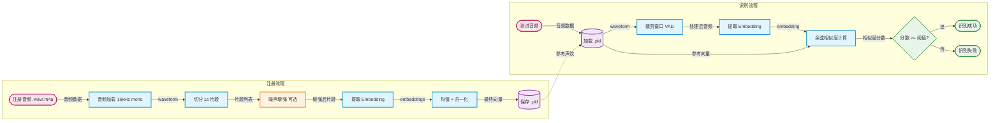

# 数据流图 (Data Flow Diagram)

```mermaid
flowchart LR
    classDef source fill:#fce4ec,stroke:#c2185b,stroke-width:2px;
    classDef process fill:#e1f5fe,stroke:#0288d1,stroke-width:2px;
    classDef store fill:#f3e5f5,stroke:#7b1fa2,stroke-width:2px;
    classDef output fill:#e8f5e9,stroke:#388e3c,stroke-width:2px;
    classDef external fill:#fff3e0,stroke:#f57c00,stroke-width:2px;

    subgraph 注册流程
        RegAudio([注册音频 .wav/.m4a]):::source
        RegLoad[音频加载 16kHz mono]:::process
        RegSplit[切分 1s 片段]:::process
        RegAug[噪声增强 可选]:::external
        RegEmb[提取 Embedding]:::process
        RegAvg[均值 + 归一化]:::process
        RegSave[(保存 .pkl)]:::store

        RegAudio -->|音频数据| RegLoad
        RegLoad -->|waveform| RegSplit
        RegSplit -->|片段列表| RegAug
        RegAug -->|增强后片段| RegEmb
        RegEmb -->|embeddings| RegAvg
        RegAvg -->|最终向量| RegSave
    end

    subgraph 识别流程
        RecAudio([测试音频]):::source
        RecLoad[音频加载]:::process
        RecCrop[裁剪窗口 VAD]:::process
        RecEmb[提取 Embedding]:::process
        RecLoad[(加载 .pkl)]:::store
        RecSim[余弦相似度计算]:::process
        RecDec{分数 >= 阈值?}:::output
        RecPass([识别成功]):::output
        RecFail([识别失败]):::output

        RecAudio -->|音频数据| RecLoad
        RecLoad -->|waveform| RecCrop
        RecCrop -->|处理后音频| RecEmb
        RecEmb -->|embedding| RecSim
        RecLoad -->|参考向量| RecSim
        RecSim -->|相似度分数| RecDec
        RecDec -->|是| RecPass
        RecDec -->|否| RecFail
    end

    RegSave -.->|参考声纹| RecLoad
```
