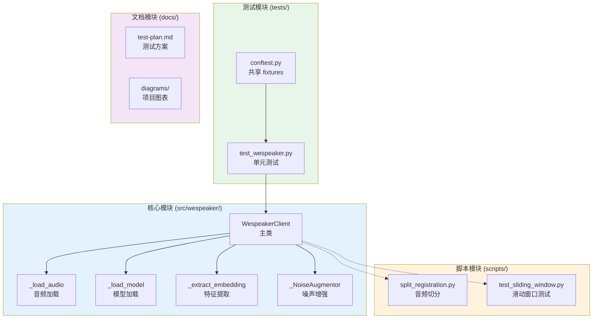

# 模块拆分图

```mermaid
graph TB
    subgraph Core["核心模块 (src/wespeaker/)"]
        A[WespeakerClient<br/>主类]
        B[_load_audio<br/>音频加载]
        C[_load_model<br/>模型加载]
        D[_extract_embedding<br/>特征提取]
        E[_NoiseAugmentor<br/>噪声增强]
    end

    subgraph Scripts["脚本模块 (scripts/)"]
        F[split_registration.py<br/>音频切分]
        G[test_sliding_window.py<br/>滑动窗口测试]
    end

    subgraph Tests["测试模块 (tests/)"]
        H[test_wespeaker.py<br/>单元测试]
        I[conftest.py<br/>共享 fixtures]
    end

    subgraph Docs["文档模块 (docs/)"]
        J[test-plan.md<br/>测试方案]
        K[diagrams/<br/>项目图表]
    end

    A --> B
    A --> C
    A --> D
    A --> E
    A -.-> F
    A -.-> G
    H --> A
    I --> H

    style Core fill:#e3f2fd
    style Scripts fill:#fff3e0
    style Tests fill:#e8f5e9
    style Docs fill:#f3e5f5
```
