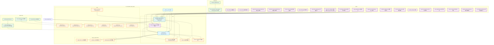

# 模块拆分图 (Module Breakdown Diagram)

```mermaid
graph TD
    classDef core fill:#e1f5fe,stroke:#0288d1,stroke-width:2px;
    classDef util fill:#fff3e0,stroke:#f57c00,stroke-width:2px;
    classDef test fill:#e8f5e9,stroke:#388e3c,stroke-width:2px;
    classDef script fill:#f3e5f5,stroke:#7b1fa2,stroke-width:2px;
    classDef deep fill:#e0f2f1,stroke:#00796b,stroke-width:2px;

    subgraph src_wespeaker_deep_edge
        Main[__main__.py CLI 入口]:::core

        subgraph core
            Wespeaker[wespeaker.py WespeakerClient]:::core
            Audio[_load_audio 音频加载 torchaudio/soundfile]:::util
            Model[_load_model 模型加载]:::util
            Extract[_extract_embedding 特征提取]:::util
            Best[best.py WespeakerBest / BestConfig]:::core
            Deep[wespeaker_deep_dege.py WespeakerDeep / DeepConfig]:::deep
        end

        subgraph legacy_augmentation
            VAD[_apply_silero_vad 静音检测]:::util
            SNR[_estimate_snr 信噪比估计]:::util
            Augment[_NoiseAugmentor 噪声增强]:::util
        end

        subgraph tools
            Diag[diagnostics.py PerformanceMetrics]:::util
            Diag2[diagnostics.py RegistrationDiagnostics]:::util
            Diag3[diagnostics.py RecognitionDiagnostics]:::util
            Report[reporters.py JsonDataExporter]:::util
            Report2[reporters.py MarkdownReportGenerator]:::util
            Report3[reporters.py TerminalReporter]:::util
            RT[realtime_monitor.py RealtimeMonitor]:::util
        end
    end

    subgraph scripts
        Split[split_registration.py 音频切分]:::script
        Sliding[test_sliding_window.py 滑动窗口测试]:::script
        Best[best_recognition.py 最佳配置 旧]:::script
        AEC[apply_aec_processing.py AEC 处理]:::script
        Cross[cross_test.py 交叉测试 旧]:::script
        CrossM[cross_test_merged.py 交叉测试 WespeakerDeep 验证]:::script
        Batch[plot_batch_summary.py 批量图表]:::script
        History[plot_history.py 历史记录]:::script
        Mix[mix_audio.py 音频混合]:::script
        MixedV[mixed_voice_test.py 混合语音测试]:::script
        ExpNoise[experiment_noise_optimization.py 噪声优化实验]:::script
        ExpTrain[experiment_train_noise_injection.py 训练注入实验]:::script
        Backfill[backfill_confidence.py 置信度回溯]:::script
        Convert[convert_sample_rate.py 采样率转换]:::script
        Rec[record_script.py 录音]:::script
        ExportVAD[export_vad_audios.py VAD 音频导出]:::script
        TestOpt[test_optimization.py 优化测试]:::script
        TestSNR[test_snr_vad.py SNR/VAD 测试]:::script
        GenVar[generate_audio_variants.py 音频变体生成]:::script
        RTRun[run_realtime_monitor.py 实时监控启动]:::script
    end

    subgraph legacy tests
        Unit[test_wespeaker.py WespeakerClient 单元测试]:::test
        OldConf[conftest.py 共享 fixtures]:::test
        DiagTest[test_diagnostics.py 诊断测试]:::test
        ReportTest[test_reporters.py 报告测试]:::test
    end

    subgraph deep tests
        DeepTest[test_wespeaker_deep_dege.py WespeakerDeep 测试]:::test
        DeepConf[conftest.py 共享 fixtures]:::test
    end

    Main --> Wespeaker
    Main --> Deep
    Wespeaker --> Audio
    Wespeaker --> Model
    Wespeaker --> Extract
    Wespeaker --> VAD
    Wespeaker --> SNR
    Wespeaker --> Augment
    Best --> Wespeaker
    Best --> Augment
    Deep --> Best
    Deep --> Diag
    Deep --> Report
    Deep --> Extract
    Deep --> Model
    Split --> Wespeaker
    Sliding --> Wespeaker
    Sliding --> Deep
    BestScript[best_recognition.py] --> Wespeaker
    BestScript[best_recognition.py] --> Best
    AEC --> Audio
    Cross --> Wespeaker
    CrossM --> Deep
    Batch --> Deep
    History --> Deep
    Mix --> Audio
    MixedV --> Deep
    ExpNoise --> Best
    ExpTrain --> Best
    RT --> Deep
    Unit --> Wespeaker
    OldConf --> Unit
    DiagTest --> Diag
    ReportTest --> Report
    DeepTest --> Deep
    DeepConf --> DeepTest
```
