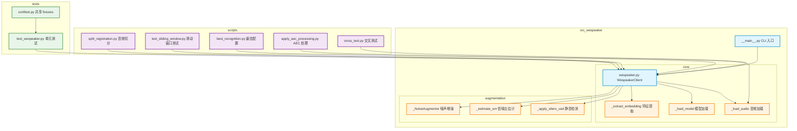

# 模块拆分图 (Module Breakdown Diagram)

```mermaid
graph TD
    classDef core fill:#e1f5fe,stroke:#0288d1,stroke-width:2px;
    classDef util fill:#fff3e0,stroke:#f57c00,stroke-width:2px;
    classDef test fill:#e8f5e9,stroke:#388e3c,stroke-width:2px;
    classDef script fill:#f3e5f5,stroke:#7b1fa2,stroke-width:2px;

    subgraph src_wespeaker
        Main[__main__.py CLI 入口]:::core

        subgraph core
            Wespeaker[wespeaker.py WespeakerClient]:::core
            Audio[_load_audio 音频加载]:::util
            Model[_load_model 模型加载]:::util
            Extract[_extract_embedding 特征提取]:::util
        end

        subgraph augmentation
            VAD[_apply_silero_vad 静音检测]:::util
            SNR[_estimate_snr 信噪比估计]:::util
            Augment[_NoiseAugmentor 噪声增强]:::util
        end
    end

    subgraph scripts
        Split[split_registration.py 音频切分]:::script
        Sliding[test_sliding_window.py 滑动窗口测试]:::script
        Best[best_recognition.py 最佳配置]:::script
        AEC[apply_aec_processing.py AEC 处理]:::script
        Cross[cross_test.py 交叉测试]:::script
    end

    subgraph tests
        Unit[test_wespeaker.py 单元测试]:::test
        Conf[conftest.py 共享 fixtures]:::test
    end

    Main --> Wespeaker
    Wespeaker --> Audio
    Wespeaker --> Model
    Wespeaker --> Extract
    Wespeaker --> VAD
    Wespeaker --> SNR
    Wespeaker --> Augment
    Split --> Wespeaker
    Sliding --> Wespeaker
    Best --> Wespeaker
    AEC --> Audio
    Cross --> Wespeaker
    Unit --> Wespeaker
    Conf --> Unit
```
