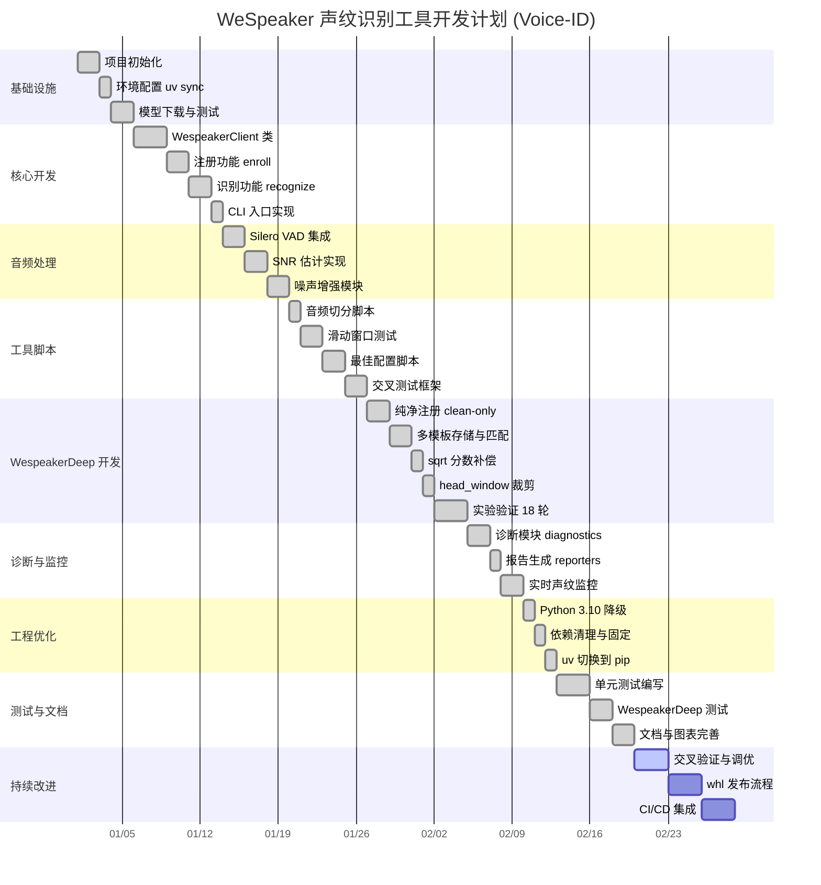

# 项目开发 Roadmap (Project Roadmap)

```mermaid
gantt
    title WeSpeaker 声纹识别工具开发计划 (Voice-ID)
    dateFormat  YYYY-MM-DD
    axisFormat  %m/%d

    section 基础设施
    项目初始化               :done,    init,      2025-01-01, 2d
    环境配置 uv sync         :done,    env,       after init, 1d
    模型下载与测试           :done,    model,     after env, 2d

    section 核心开发
    WespeakerClient 类       :done,    client,    after model, 3d
    注册功能 enroll          :done,    enroll,    after client, 2d
    识别功能 recognize       :done,    recognize, after enroll, 2d
    CLI 入口实现             :done,    cli,       after recognize, 1d

    section 音频处理
    Silero VAD 集成          :done,    vad,       after cli, 2d
    SNR 估计实现             :done,    snr,       after vad, 2d
    噪声增强模块             :done,    augment,   after snr, 2d

    section 工具脚本
    音频切分脚本             :done,    split,     after augment, 1d
    滑动窗口测试             :done,    sliding,   after split, 2d
    最佳配置脚本             :done,    best,      after sliding, 2d
    交叉测试框架             :done,    cross,     after best, 2d

    section WespeakerDeep 开发
    纯净注册 clean-only      :done,    clean,     after cross, 2d
    多模板存储与匹配         :done,    multi,     after clean, 2d
    sqrt 分数补偿            :done,    sqrt,      after multi, 1d
    head_window 裁剪         :done,    head,      after sqrt, 1d
    实验验证 18 轮           :done,    exp18,     after head, 3d

    section 诊断与监控
    诊断模块 diagnostics     :done,    diag,      after exp18, 2d
    报告生成 reporters       :done,    report,    after diag, 1d
    实时声纹监控             :done,    rt,        after report, 2d

    section 工程优化
    Python 3.10 降级         :done,    py310,     after rt, 1d
    依赖清理与固定           :done,    deps,      after py310, 1d
    uv 切换到 pip            :done,    uv,        after deps, 1d

    section 测试与文档
    单元测试编写             :done,    test,      after uv, 3d
    WespeakerDeep 测试       :done,    dtest,     after test, 2d
    文档与图表完善           :done,    doc,       after dtest, 2d

    section 持续改进
    交叉验证与调优           :active,  cv,        after doc, 3d
    whl 发布流程             :         whl,       after cv, 3d
    CI/CD 集成               :         cicd,      after whl, 3d
```
