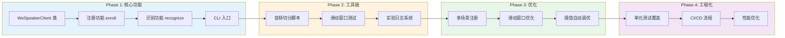

# Roadmap 图

```mermaid
graph LR
    subgraph Phase1["Phase 1: 核心功能"]
        A[WeSpeakerClient 类]
        B[注册功能 enroll]
        C[识别功能 recognize]
        D[CLI 入口]
    end

    subgraph Phase2["Phase 2: 工具链"]
        E[音频切分脚本]
        F[滑动窗口测试]
        G[实验日志系统]
    end

    subgraph Phase3["Phase 3: 优化"]
        H[多场景注册]
        I[滑动窗口优化]
        J[阈值自动调优]
    end

    subgraph Phase4["Phase 4: 工程化"]
        K[单元测试覆盖]
        L[CI/CD 流程]
        M[性能优化]
    end

    A --> B --> C --> D
    D --> E --> F --> G
    G --> H --> I --> J
    J --> K --> L --> M

    style Phase1 fill:#e3f2fd
    style Phase2 fill:#fff3e0
    style Phase3 fill:#e8f5e9
    style Phase4 fill:#f3e5f5
```
