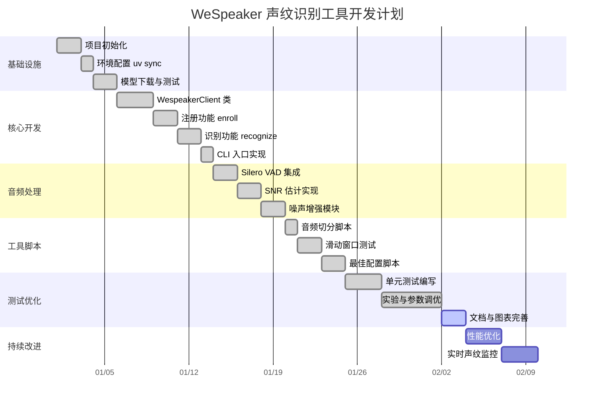

# 项目开发 Roadmap (Project Roadmap)

```mermaid
gantt
    title WeSpeaker 声纹识别工具开发计划
    dateFormat  YYYY-MM-DD
    axisFormat  %m/%d

    section 基础设施
    项目初始化           :done,    init,      2025-01-01, 2d
    环境配置 uv sync     :done,    env,       after init, 1d
    模型下载与测试       :done,    model,     after env, 2d

    section 核心开发
    WespeakerClient 类   :done,    client,    after model, 3d
    注册功能 enroll      :done,    enroll,    after client, 2d
    识别功能 recognize   :done,    recognize, after enroll, 2d
    CLI 入口实现         :done,    cli,       after recognize, 1d

    section 音频处理
    Silero VAD 集成      :done,    vad,       after cli, 2d
    SNR 估计实现         :done,    snr,       after vad, 2d
    噪声增强模块         :done,    augment,   after snr, 2d

    section 工具脚本
    音频切分脚本         :done,    split,     after augment, 1d
    滑动窗口测试         :done,    sliding,   after split, 2d
    最佳配置脚本         :done,    best,      after sliding, 2d

    section 测试优化
    单元测试编写         :done,    test,      after best, 3d
    实验与参数调优       :done,    exp,       after test, 5d
    文档与图表完善       :active,  doc,       after exp, 2d

    section 持续改进
    性能优化            :         perf,      after doc, 3d
    实时声纹监控        :         realtime,  after perf, 3d
```
