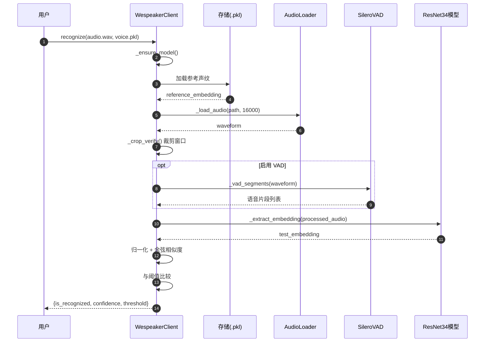

# 时序图 (Sequence Diagram)

## 注册流程时序图

```mermaid
sequenceDiagram
    autonumber
    participant U as 用户
    participant C as WespeakerClient
    participant L as AudioLoader
    participant V as SileroVAD
    participant A as NoiseAugmentor
    participant M as ResNet34模型
    participant S as 存储(.pkl)

    U->>C: enroll(audio.wav, voice.pkl)
    C->>C: _ensure_model()
    C->>L: _load_audio(path, 16000)
    L-->>C: waveform (16kHz, mono)

    C->>C: 切分为 1s 片段

    opt 启用噪声增强
        C->>A: augment(segments)
        A-->>C: 增强后片段
    end

    loop 每个片段
        C->>M: _extract_embedding(waveform)
        M-->>C: 256 维 embedding
    end

    opt 启用 SNR 加权
        C->>C: _estimate_snr() 计算权重
        C->>C: 加权平均 + 归一化
    else 普通平均
        C->>C: 均值 + 归一化
    end

    C->>S: pickle.dump(embedding)
    S-->>C: 保存成功
    C-->>U: {ok: true, num_segments: N, pk_path}
```

## 识别流程时序图


