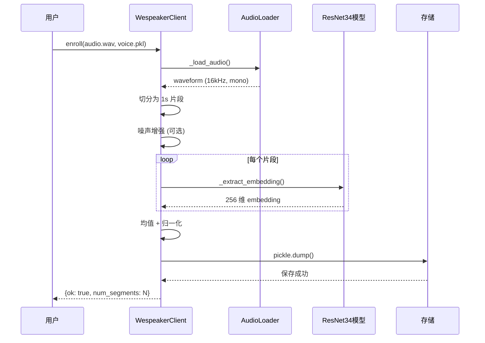
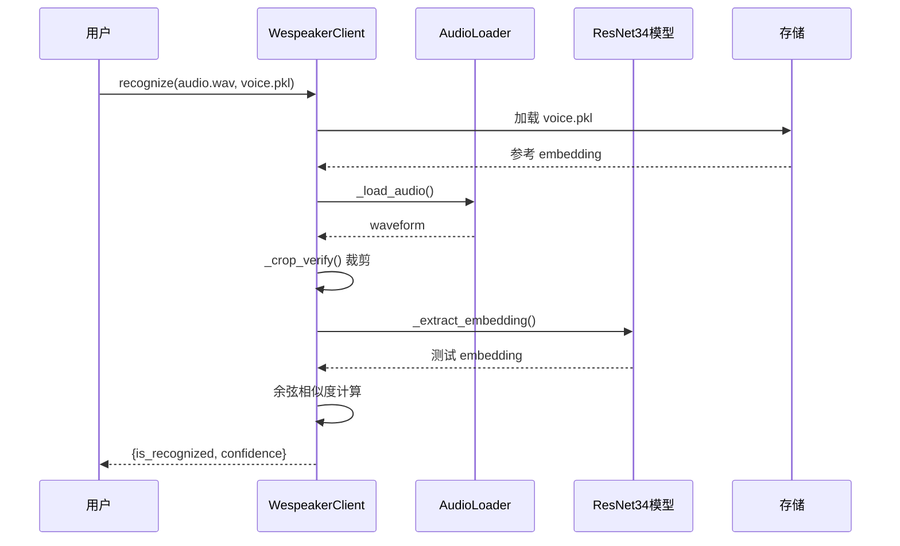

# 时序图

## 注册流程

```mermaid
sequenceDiagram
    participant U as 用户
    participant C as WespeakerClient
    participant A as AudioLoader
    participant M as ResNet34模型
    participant S as 存储

    U->>C: enroll(audio.wav, voice.pkl)
    C->>A: _load_audio()
    A-->>C: waveform (16kHz, mono)
    C->>C: 切分为 1s 片段
    C->>C: 噪声增强 (可选)
    loop 每个片段
        C->>M: _extract_embedding()
        M-->>C: 256 维 embedding
    end
    C->>C: 均值 + 归一化
    C->>S: pickle.dump()
    S-->>C: 保存成功
    C-->>U: {ok: true, num_segments: N}
```

## 识别流程

```mermaid
sequenceDiagram
    participant U as 用户
    participant C as WespeakerClient
    participant A as AudioLoader
    participant M as ResNet34模型
    participant S as 存储

    U->>C: recognize(audio.wav, voice.pkl)
    C->>S: 加载 voice.pkl
    S-->>C: 参考 embedding
    C->>A: _load_audio()
    A-->>C: waveform
    C->>C: _crop_verify() 裁剪
    C->>M: _extract_embedding()
    M-->>C: 测试 embedding
    C->>C: 余弦相似度计算
    C-->>U: {is_recognized, confidence}
```
