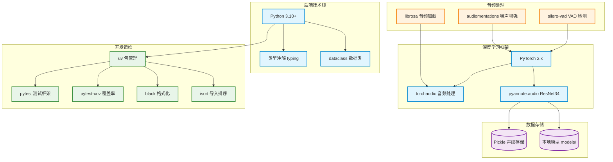

# 技术栈图 (Tech Stack Diagram)

```mermaid
graph TB
    classDef backend fill:#e1f5fe,stroke:#0288d1,stroke-width:2px;
    classDef infra fill:#f3e5f5,stroke:#7b1fa2,stroke-width:2px;
    classDef devops fill:#e8f5e9,stroke:#388e3c,stroke-width:2px;
    classDef audio fill:#fff3e0,stroke:#f57c00,stroke-width:2px;

    subgraph 后端技术栈
        Python[Python 3.10+]:::backend
        Type[类型注解 typing]:::backend
        Data[dataclass 数据类]:::backend
    end

    subgraph 深度学习框架
        Torch[PyTorch 2.x]:::backend
        TorchAudio[torchaudio 音频处理]:::backend
        Pyannote[pyannote.audio ResNet34]:::backend
    end

    subgraph 音频处理
        Librosa[librosa 音频加载]:::audio
        Silero[silero-vad VAD 检测]:::audio
        Augment[audiomentations 噪声增强]:::audio
    end

    subgraph 数据存储
        Pkl[(Pickle 声纹存储)]:::infra
        Model[(本地模型 models/)]:::infra
    end

    subgraph 开发运维
        UV[uv 包管理]:::devops
        Pytest[pytest 测试框架]:::devops
        Cov[pytest-cov 覆盖率]:::devops
        Black[black 格式化]:::devops
        Isort[isort 导入排序]:::devops
    end

    Python --> Type
    Python --> Data
    Torch --> TorchAudio
    Torch --> Pyannote
    Librosa --> TorchAudio
    Silero --> Torch
    Augment --> Torch
    Pyannote --> Pkl
    Pyannote --> Model
    Python --> UV
    UV --> Pytest
    UV --> Cov
    UV --> Black
    UV --> Isort
```
