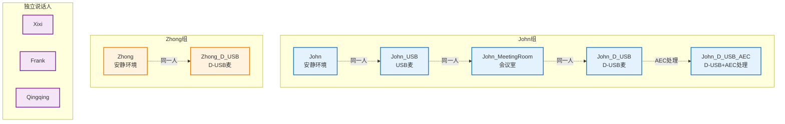

# 测试配置图 (Test Configuration Diagram)

## 说话人分组矩阵

## 交叉测试矩阵 (10x10)

| 说话人 | John | John_USB | John_MeetingRoom | John_D_USB | John_D_USB_AEC | Zhong | Zhong_D_USB | Xixi | Frank | Qingqing |
|--------|------|----------|------------------|------------|----------------|-------|-------------|------|--------|----------|
| **John** | ✅ | ✅ | ✅ | ✅ | ✅ | ❌ | ❌ | ❌ | ❌ | ❌ |
| **John_USB** | ✅ | ✅ | ✅ | ✅ | ✅ | ❌ | ❌ | ❌ | ❌ | ❌ |
| **John_MeetingRoom** | ✅ | ✅ | ✅ | ✅ | ✅ | ❌ | ❌ | ❌ | ❌ | ❌ |
| **John_D_USB** | ✅ | ✅ | ✅ | ✅ | ✅ | ❌ | ❌ | ❌ | ❌ | ❌ |
| **John_D_USB_AEC** | ✅ | ✅ | ✅ | ✅ | ✅ | ❌ | ❌ | ❌ | ❌ | ❌ |
| **Zhong** | ❌ | ❌ | ❌ | ❌ | ❌ | ✅ | ✅ | ❌ | ❌ | ❌ |
| **Zhong_D_USB** | ❌ | ❌ | ❌ | ❌ | ❌ | ✅ | ✅ | ❌ | ❌ | ❌ |
| **Xixi** | ❌ | ❌ | ❌ | ❌ | ❌ | ❌ | ❌ | ✅ | ❌ | ❌ |
| **Frank** | ❌ | ❌ | ❌ | ❌ | ❌ | ❌ | ❌ | ❌ | ✅ | ❌ |
| **Qingqing** | ❌ | ❌ | ❌ | ❌ | ❌ | ❌ | ❌ | ❌ | ❌ | ✅ |

## 测试目的

1. **同人匹配测试**: 验证同一人不同录制条件下的声纹一致性
2. **AEC 影响测试**: 验证 AEC 处理对声纹识别的影响
3. **误拒绝测试**: 确保同人变体不被误拒绝
4. **误接受测试**: 确保不同人之间不会误匹配

## AEC 处理效果

`John_D_USB_AEC` 通过以下处理模拟 AEC 的特征：
- **降噪** (70% 强度) - 去除背景噪声
- **高通滤波** (80 Hz) - 去除低频噪声
- **动态压缩** (-20 dB, 4:1) - 压制峰值
- **间歇性"水下"失真** - 20% 概率/秒，150-600ms
  - 低通滤波（700 Hz）去除高频
  - 产生沉闷、在水里说话的感觉
  - 轻微衰减（0.7x）模拟"被压制"
