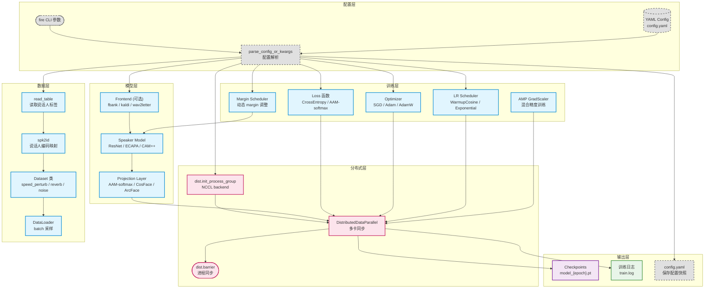

# 训练系统总体架构图 (Training System Architecture Diagram)

```mermaid
graph TB
    classDef config fill:#e0e0e0,stroke:#616161,stroke-width:2px,stroke-dasharray: 5 5;
    classDef core fill:#e1f5fe,stroke:#0288d1,stroke-width:2px;
    classDef storage fill:#f3e5f5,stroke:#7b1fa2,stroke-width:2px;
    classDef external fill:#fff3e0,stroke:#f57c00,stroke-width:2px;
    classDef output fill:#e8f5e9,stroke:#388e3c,stroke-width:2px;
    classDef infra fill:#fce4ec,stroke:#c2185b,stroke-width:2px;

    subgraph 配置层
        Config[("YAML Config<br/>config.yaml")]:::config
        CLI([fire CLI 参数]):::config
        Parser[parse_config_or_kwargs<br/>配置解析]:::config
    end

    subgraph 分布式层
        DistInit[dist.init_process_group<br/>NCCL backend]:::infra
        DDP[DistributedDataParallel<br/>多卡同步]:::infra
        Barrier([dist.barrier<br/>进程同步]):::infra
    end

    subgraph 数据层
        Table[read_table<br/>读取说话人标签]:::core
        Spk2ID[spk2id<br/>说话人编码映射]:::core
        Dataset["Dataset 类<br/>speed_perturb / reverb / noise"]:::core
        Loader["DataLoader<br/>batch 采样"]:::core
    end

    subgraph 模型层
        Frontend["Frontend (可选)<br/>fbank / kaldi / wav2letter"]:::core
        SpkModel["Speaker Model<br/>ResNet / ECAPA / CAM++"]:::core
        Projection["Projection Layer<br/>AAM-softmax / CosFace / ArcFace"]:::core
    end

    subgraph 训练层
        Loss["Loss 函数<br/>CrossEntropy / AAM-softmax"]:::core
        Optimizer["Optimizer<br/>SGD / Adam / AdamW"]:::core
        Scheduler["LR Scheduler<br/>WarmupCosine / Exponential"]:::core
        MarginScheduler["Margin Scheduler<br/>动态 margin 调整"]:::core
        Scaler["AMP GradScaler<br/>混合精度训练"]:::core
    end

    subgraph 输出层
        Checkpoints["Checkpoints<br/>model_{epoch}.pt"]:::storage
        Logs["训练日志<br/>train.log"]:::output
        ConfigSave["config.yaml<br/>保存配置快照"]:::config
    end

    CLI --> Parser
    Config --> Parser
    Parser --> DistInit
    Parser --> Table
    DistInit --> DDP
    DDP --> Barrier

    Table --> Spk2ID
    Spk2ID --> Dataset
    Dataset --> Loader

    Parser --> Frontend
    Frontend --> SpkModel
    SpkModel --> Projection
    Projection --> DDP

    Parser --> Loss
    Parser --> Optimizer
    Parser --> Scheduler
    Parser --> MarginScheduler
    Loss --> DDP
    Optimizer --> DDP
    Scheduler --> DDP
    MarginScheduler --> SpkModel
    Scaler --> DDP

    DDP --> Checkpoints
    DDP --> Logs
    Parser --> ConfigSave
```
