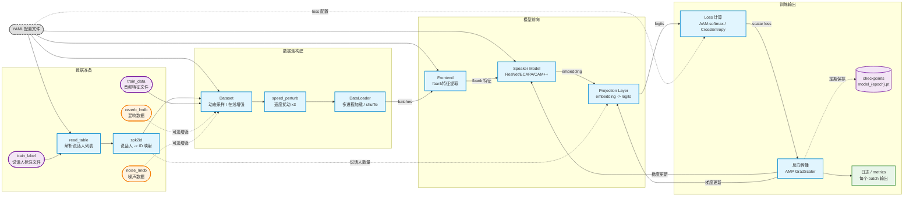

# 训练数据流图 (Training Data Flow Diagram)

```mermaid
flowchart LR
    classDef config fill:#e0e0e0,stroke:#616161,stroke-width:2px,stroke-dasharray: 5 5;
    classDef process fill:#e1f5fe,stroke:#0288d1,stroke-width:2px;
    classDef storage fill:#f3e5f5,stroke:#7b1fa2,stroke-width:2px;
    classDef output fill:#e8f5e9,stroke:#388e3c,stroke-width:2px;
    classDef external fill:#fff3e0,stroke:#f57c00,stroke-width:2px;

    Config([YAML 配置文件]):::config

    subgraph 数据准备
        Label([train_label<br/>说话人标注文件]):::storage
        Data([train_data<br/>音频特征文件]):::storage
        Reverb([reverb_lmdb<br/>混响数据]):::external
        Noise([noise_lmdb<br/>噪声数据]):::external

        Table[read_table<br/>解析说话人列表]:::process
        Spk2ID["spk2id<br/>说话人 -> ID 映射"]:::process
    end

    subgraph 数据集构建
        Speed["speed_perturb<br/>速度扰动 x3"]:::process
        Dataset["Dataset<br/>动态采样 / 在线增强"]:::process
        Loader["DataLoader<br/>多进程加载 / shuffle"]:::process
    end

    subgraph 模型前向
        Front["Frontend<br/>fbank特征提取"]:::process
        Model["Speaker Model<br/>ResNet/ECAPA/CAM++"]:::process
        Proj["Projection Layer<br/>embedding -> logits"]:::process
    end

    subgraph 训练输出
        Loss["Loss 计算<br/>AAM-softmax / CrossEntropy"]:::process
        Backward["反向传播<br/>AMP GradScaler"]:::process
        CKPT[("checkpoints<br/>model_{epoch}.pt")]:::storage
        Logs["日志 / metrics<br/>每个 batch 输出"]:::output
    end

    Config --> Table
    Config --> Dataset
    Config --> Front
    Config --> Model

    Label --> Table
    Table --> Spk2ID
    Spk2ID --> Dataset

    Data --> Dataset
    Reverb -.->|可选增强| Dataset
    Noise -.->|可选增强| Dataset

    Dataset --> Speed
    Speed --> Loader

    Loader -->|batches| Front
    Front -->|fbank 特征| Model
    Model -->|embedding| Proj
    Proj -->|logits| Loss

    Spk2ID -.->|说话人数量| Proj
    Config -.->|loss 配置| Loss

    Loss -->|scalar loss| Backward
    Backward -->|梯度更新| Model
    Backward -->|梯度更新| Proj

    Backward -.->|定期保存| CKPT
    Backward --> Logs
```
