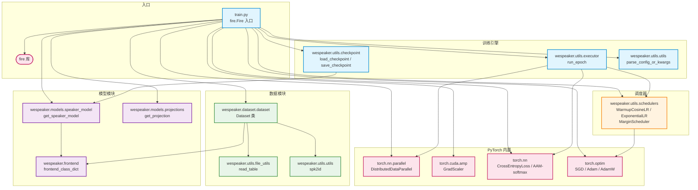

# 训练模块拆分图 (Training Module Breakdown Diagram)

```mermaid
graph TD
    classDef core fill:#e1f5fe,stroke:#0288d1,stroke-width:2px;
    classDef util fill:#fff3e0,stroke:#f57c00,stroke-width:2px;
    classDef model fill:#f3e5f5,stroke:#7b1fa2,stroke-width:2px;
    classDef data fill:#e8f5e9,stroke:#388e3c,stroke-width:2px;
    classDef infra fill:#fce4ec,stroke:#c2185b,stroke-width:2px;

    subgraph 入口
        Main["train.py<br/>fire.Fire 入口"]:::core
        Fire([fire 库]):::infra
    end

    subgraph 数据模块
        Dataset["wespeaker.dataset.dataset<br/>Dataset 类"]:::data
        ReadTable["wespeaker.utils.file_utils<br/>read_table"]:::data
        SpkID["wespeaker.utils.utils<br/>spk2id"]:::data
    end

    subgraph 模型模块
        SpkModel["wespeaker.models.speaker_model<br/>get_speaker_model"]:::model
        Proj["wespeaker.models.projections<br/>get_projection"]:::model
        Front["wespeaker.frontend<br/>frontend_class_dict"]:::model
    end

    subgraph 训练引擎
        Executor["wespeaker.utils.executor<br/>run_epoch"]:::core
        Checkpoint["wespeaker.utils.checkpoint<br/>load_checkpoint / save_checkpoint"]:::core
        ConfigParse["wespeaker.utils.utils<br/>parse_config_or_kwargs"]:::core
    end

    subgraph 调度器
        Schedulers["wespeaker.utils.schedulers<br/>WarmupCosineLR / ExponentialLR<br/>MarginScheduler"]:::util
    end

    subgraph PyTorch 内置
        DDP["torch.nn.parallel<br/>DistributedDataParallel"]:::infra
        AMP["torch.cuda.amp<br/>GradScaler"]:::infra
        Loss["torch.nn<br/>CrossEntropyLoss / AAM-softmax"]:::infra
        Optim["torch.optim<br/>SGD / Adam / AdamW"]:::infra
    end

    Main --> Fire
    Main --> ConfigParse
    Main --> Dataset
    Main --> SpkModel
    Main --> Proj
    Main --> Schedulers
    Main --> Executor
    Main --> Checkpoint
    Main --> DDP
    Main --> AMP
    Main --> Loss
    Main --> Optim

    Dataset --> ReadTable
    Dataset --> SpkID
    Dataset --> Front
    SpkModel --> Front

    Schedulers --> Optim

    Executor --> DDP
    Executor --> Loss
    Executor --> Schedulers

    Checkpoint --> SpkModel
```
