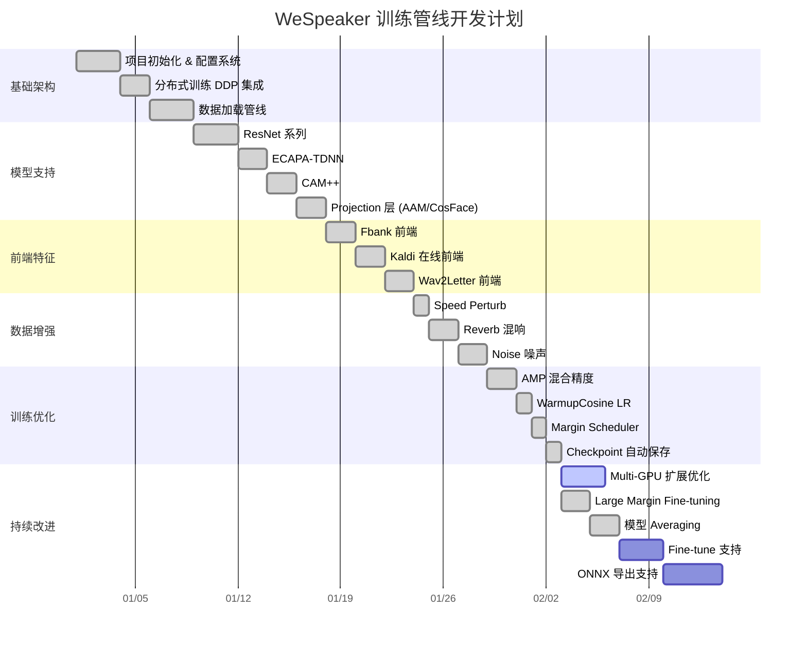

# 训练管线开发路线图 (Training Pipeline Roadmap)

```mermaid
gantt
    title WeSpeaker 训练管线开发计划
    dateFormat  YYYY-MM-DD
    axisFormat  %m/%d

    section 基础架构
    项目初始化 & 配置系统   :done,    init,      2025-01-01, 3d
    分布式训练 DDP 集成    :done,    ddp,       after init, 2d
    数据加载管线           :done,    data,      after ddp, 3d

    section 模型支持
    ResNet 系列               :done,    resnet,    after data, 3d
    ECAPA-TDNN               :done,    ecapa,     after resnet, 2d
    CAM++                    :done,    campp,     after ecapa, 2d
    Projection 层 (AAM/CosFace) :done,  proj,     after campp, 2d

    section 前端特征
    Fbank 前端               :done,    fbank,     after proj, 2d
    Kaldi 在线前端           :done,    kaldi,     after fbank, 2d
    Wav2Letter 前端          :done,    wav2,      after kaldi, 2d

    section 数据增强
    Speed Perturb            :done,    speed,     after wav2, 1d
    Reverb 混响              :done,    reverb,    after speed, 2d
    Noise 噪声               :done,    noise,     after reverb, 2d

    section 训练优化
    AMP 混合精度             :done,    amp,       after noise, 2d
    WarmupCosine LR          :done,    lr,        after amp, 1d
    Margin Scheduler         :done,    margin,    after lr, 1d
    Checkpoint 自动保存       :done,    ckpt,      after margin, 1d

    section 持续改进
    Multi-GPU 扩展优化        :active,  multi,     after ckpt, 3d
    Large Margin Fine-tuning :done,    lm,        after ckpt, 2d
    模型 Averaging            :done,    avg,       after lm, 2d
    Fine-tune 支持            :         finetune,  after avg, 3d
    ONNX 导出支持             :         onnx,      after finetune, 4d
```
