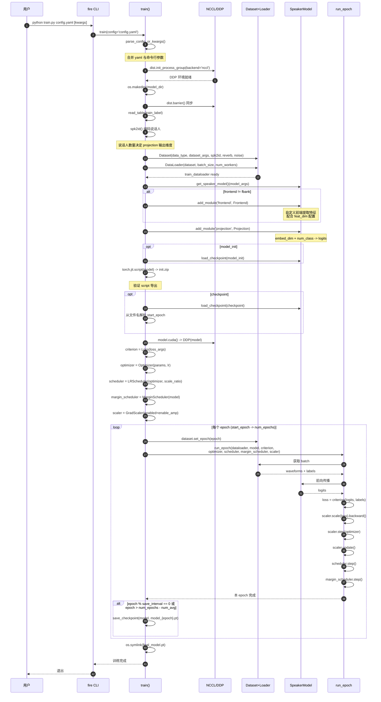

# 训练时序图 (Training Sequence Diagram)

> 此图描述上游 WeSpeaker 训练框架。`wespeaker.*` 引用指向 upstream pip 包，非本地 `wespeaker_deep_edge` 推理模块。

```mermaid
sequenceDiagram
    autonumber
    participant U as 用户
    participant CLI as fire CLI
    participant Main as train()
    participant Dist as NCCL/DDP
    participant Data as Dataset+Loader
    participant Model as SpeakerModel
    participant Train as run_epoch

    U->>CLI: python train.py config.yaml [kwargs]
    CLI->>Main: train(config='config.yaml')

    Main->>Main: parse_config_or_kwargs()
    Note over Main: 合并 yaml 与命令行参数

    Main->>Dist: dist.init_process_group(backend='nccl')
    Dist-->>Main: DDP 环境就绪

    Main->>Main: os.makedirs(model_dir)
    Main->>Dist: dist.barrier() 同步

    Main->>Main: read_table(train_label)
    Main->>Main: spk2id() 编码说话人
    Note over Main: 说话人数量决定 projection 输出维度

    Main->>Data: Dataset(data_type, dataset_args, spk2id, reverb, noise)
    Main->>Data: DataLoader(dataset, batch_size, num_workers)
    Data-->>Main: train_dataloader ready

    Main->>Model: get_speaker_model()(model_args)

    alt frontend != fbank
        Main->>Model: add_module('frontend', Frontend)
        Note over Model: 自定义前端提取特征<br/>配合 feat_dim 配置
    end

    Main->>Model: add_module('projection', Projection)
    Note over Model: embed_dim + num_class -> logits

    opt model_init
        Main->>Model: load_checkpoint(model_init)
    end

    Main->>Main: torch.jit.script(model) -> init.zip
    Note over Main: 验证 script 导出

    opt checkpoint
        Main->>Model: load_checkpoint(checkpoint)
        Main->>Main: 从文件名解析 start_epoch
    end

    Main->>Dist: model.cuda() -> DDP(model)
    Main->>Main: criterion = Loss(loss_args)
    Main->>Main: optimizer = Optimizer(params, lr)
    Main->>Main: scheduler = LRScheduler(optimizer, scale_ratio)
    Main->>Main: margin_scheduler = MarginScheduler(model)
    Main->>Main: scaler = GradScaler(enabled=enable_amp)

    loop 每个 epoch (start_epoch -> num_epochs)
        Main->>Data: dataset.set_epoch(epoch)
        Main->>Train: run_epoch(dataloader, model, criterion,<br/>optimizer, scheduler, margin_scheduler, scaler)

        Train->>Data: 获取 batch
        Data-->>Train: waveforms + labels

        Train->>Model: 前向传播
        Model-->>Train: logits

        Train->>Train: loss = criterion(logits, labels)
        Train->>Train: scaler.scale(loss).backward()
        Train->>Train: scaler.step(optimizer)
        Train->>Train: scaler.update()
        Train->>Train: scheduler.step()
        Train->>Train: margin_scheduler.step()

        Train-->>Main: 本 epoch 完成

        alt epoch % save_interval == 0 或 epoch > num_epochs - num_avg
            Main->>Main: save_checkpoint(model, model_{epoch}.pt)
        end
    end

    Main->>Main: os.symlink(final_model.pt)
    Main-->>CLI: 训练完成
    CLI-->>U: 退出
```
