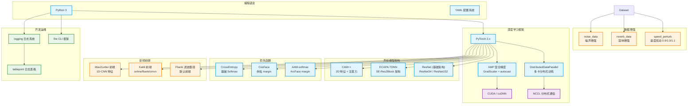

# 训练技术栈图 (Training Tech Stack Diagram)

```mermaid
graph TB
    classDef core fill:#e1f5fe,stroke:#0288d1,stroke-width:2px;
    classDef infra fill:#f3e5f5,stroke:#7b1fa2,stroke-width:2px;
    classDef devops fill:#e8f5e9,stroke:#388e3c,stroke-width:2px;
    classDef audio fill:#fff3e0,stroke:#f57c00,stroke-width:2px;

    subgraph 编程语言
        Python[Python 3]:::core
        YAML[YAML 配置系统]:::core
    end

    subgraph 深度学习框架
        Torch[PyTorch 2.x]:::core
        DDP["DistributedDataParallel<br/>多卡分布式训练"]:::core
        AMP["AMP 混合精度<br/>GradScaler + autocast"]:::core
        CUDA[CUDA / cuDNN]:::infra
        NCCL[NCCL 分布式通信]:::infra
    end

    subgraph 声纹模型架构
        ResNet["ResNet (基础架构)<br/>ResNet34 / ResNet152"]:::core
        ECAPA["ECAPA-TDNN<br/>SE-Res2Block 架构"]:::core
        CAMPP["CAM++<br/>2D 特征 + 注意力"]:::core
    end

    subgraph 损失函数
        AAM[AAM-softmax<br/>ArcFace margin]:::core
        CosFace[CosFace<br/>余弦 margin]:::core
        Softmax[CrossEntropy<br/>基础 Softmax]:::core
    end

    subgraph 音频前端
        Fbank["Fbank 滤波器组<br/>默认前端"]:::audio
        Kaldi["Kaldi 前端<br/>online/fbank/cmvn"]:::audio
        Wav2Letter["Wav2Letter 前端<br/>1D-CNN 特征"]:::audio
    end

    subgraph 数据增强
        Speed["speed_perturb<br/>速度扰动 0.9/1.0/1.1"]:::audio
        Reverb["reverb_data<br/>混响增强"]:::audio
        Noise["noise_data<br/>噪声增强"]:::audio
    end

    subgraph 开发运维
        Fire[fire CLI 框架]:::devops
        TablePrint[tableprint 日志表格]:::devops
        Logger[logging 日志系统]:::devops
    end

    Python --> Torch
    Torch --> DDP
    Torch --> AMP
    DDP --> NCCL
    AMP --> CUDA

    Torch --> ResNet
    Torch --> ECAPA
    Torch --> CAMPP

    Torch --> AAM
    Torch --> CosFace
    Torch --> Softmax

    Torch --> Fbank
    Torch --> Kaldi
    Torch --> Wav2Letter

    Dataset --> Speed
    Dataset --> Reverb
    Dataset --> Noise

    Python --> Fire
    Python --> Logger
    Logger --> TablePrint
```
