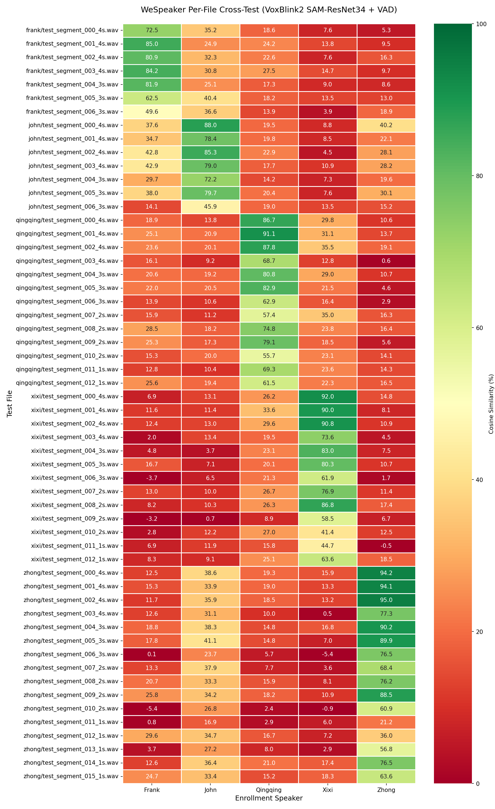
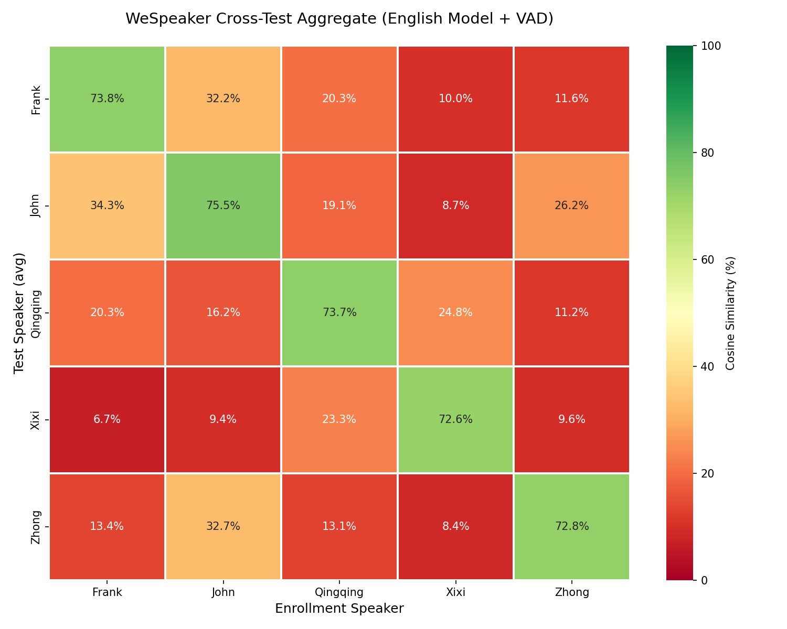

# Cross-Test Report — 20260520_024930

**Enrollment source**: `asset_combine/` (single file per person)
**Test source**: `asset/{person}/test_segments/`
**Model**: vblinkf (VAD+ CMN=True mel=80)

## Modifications

Enrollment: asset_combine/*.wav (single file per person)

## Summary

| Metric | Value |
|--------|-------|
| Same-person mean | 73.7% |
| Different-person mean | 17.6% |
| Gap | 56.1% |

## Per-Person

| Person | Self | Other | Gap | Tests |
|--------|------|-------|-----|-------|
| Frank | 73.8% | 18.5% | 55.3% | 7 |
| John | 75.5% | 22.1% | 53.4% | 7 |
| Qingqing | 73.7% | 18.1% | 55.6% | 13 |
| Xixi | 72.6% | 12.2% | 60.3% | 13 |
| Zhong | 72.8% | 16.9% | 55.9% | 16 |

## Per-File Details

Test Person | Test File | Frank | John | Qingqing | Xixi | Zhong |
|---|---|---|---|---|---|---|
frank | test_segment_000_4s.wav | 72.5% | 35.2% | 18.6% | 7.6% | 5.3%
frank | test_segment_001_4s.wav | 85.0% | 24.9% | 24.2% | 13.8% | 9.5%
frank | test_segment_002_4s.wav | 80.9% | 32.3% | 22.6% | 7.6% | 16.3%
frank | test_segment_003_4s.wav | 84.2% | 30.8% | 27.5% | 14.7% | 9.7%
frank | test_segment_004_3s.wav | 81.9% | 25.1% | 17.3% | 9.0% | 8.6%
frank | test_segment_005_3s.wav | 62.5% | 40.4% | 18.2% | 13.5% | 13.0%
frank | test_segment_006_3s.wav | 49.6% | 36.6% | 13.9% | 3.9% | 18.9%
john | test_segment_000_4s.wav | 37.6% | 88.0% | 19.5% | 8.8% | 40.2%
john | test_segment_001_4s.wav | 34.7% | 78.4% | 19.8% | 8.5% | 22.1%
john | test_segment_002_4s.wav | 42.8% | 85.3% | 22.9% | 4.5% | 28.1%
john | test_segment_003_4s.wav | 42.9% | 79.0% | 17.7% | 10.9% | 28.2%
john | test_segment_004_3s.wav | 29.7% | 72.2% | 14.2% | 7.3% | 19.6%
john | test_segment_005_3s.wav | 38.0% | 79.7% | 20.4% | 7.6% | 30.1%
john | test_segment_006_3s.wav | 14.1% | 45.9% | 19.0% | 13.5% | 15.2%
qingqing | test_segment_000_4s.wav | 18.9% | 13.8% | 86.7% | 29.8% | 10.6%
qingqing | test_segment_001_4s.wav | 25.1% | 20.9% | 91.1% | 31.1% | 13.7%
qingqing | test_segment_002_4s.wav | 23.6% | 20.1% | 87.8% | 35.5% | 19.1%
qingqing | test_segment_003_4s.wav | 16.1% | 9.2% | 68.7% | 12.8% | 0.6%
qingqing | test_segment_004_3s.wav | 20.6% | 19.2% | 80.8% | 29.0% | 10.7%
qingqing | test_segment_005_3s.wav | 22.0% | 20.5% | 82.9% | 21.5% | 4.6%
qingqing | test_segment_006_3s.wav | 13.9% | 10.6% | 62.9% | 16.4% | 2.9%
qingqing | test_segment_007_2s.wav | 15.9% | 11.2% | 57.4% | 35.0% | 16.3%
qingqing | test_segment_008_2s.wav | 28.5% | 18.2% | 74.8% | 23.8% | 16.4%
qingqing | test_segment_009_2s.wav | 25.3% | 17.3% | 79.1% | 18.5% | 5.6%
qingqing | test_segment_010_2s.wav | 15.3% | 20.0% | 55.7% | 23.1% | 14.1%
qingqing | test_segment_011_1s.wav | 12.8% | 10.4% | 69.3% | 23.6% | 14.3%
qingqing | test_segment_012_1s.wav | 25.6% | 19.4% | 61.5% | 22.3% | 16.5%
xixi | test_segment_000_4s.wav | 6.9% | 13.1% | 26.2% | 92.0% | 14.8%
xixi | test_segment_001_4s.wav | 11.6% | 11.4% | 33.6% | 90.0% | 8.1%
xixi | test_segment_002_4s.wav | 12.4% | 13.0% | 29.6% | 90.8% | 10.9%
xixi | test_segment_003_4s.wav | 2.0% | 13.4% | 19.5% | 73.6% | 4.5%
xixi | test_segment_004_3s.wav | 4.8% | 3.7% | 23.1% | 83.0% | 7.5%
xixi | test_segment_005_3s.wav | 16.7% | 7.1% | 20.1% | 80.3% | 10.7%
xixi | test_segment_006_3s.wav | -3.7% | 6.5% | 21.3% | 61.9% | 1.7%
xixi | test_segment_007_2s.wav | 13.0% | 10.0% | 26.7% | 76.9% | 11.4%
xixi | test_segment_008_2s.wav | 8.2% | 10.3% | 26.3% | 86.8% | 17.4%
xixi | test_segment_009_2s.wav | -3.2% | 0.7% | 8.9% | 58.5% | 6.7%
xixi | test_segment_010_2s.wav | 2.8% | 12.2% | 27.0% | 41.4% | 12.5%
xixi | test_segment_011_1s.wav | 6.9% | 11.9% | 15.8% | 44.7% | -0.5%
xixi | test_segment_012_1s.wav | 8.3% | 9.1% | 25.1% | 63.6% | 18.5%
zhong | test_segment_000_4s.wav | 12.5% | 38.6% | 19.3% | 15.9% | 94.2%
zhong | test_segment_001_4s.wav | 15.3% | 33.9% | 19.0% | 13.3% | 94.1%
zhong | test_segment_002_4s.wav | 11.7% | 35.9% | 18.5% | 13.2% | 95.0%
zhong | test_segment_003_4s.wav | 12.6% | 31.1% | 10.0% | 0.5% | 77.3%
zhong | test_segment_004_3s.wav | 18.8% | 38.3% | 14.8% | 16.8% | 90.2%
zhong | test_segment_005_3s.wav | 17.8% | 41.1% | 14.8% | 7.0% | 89.9%
zhong | test_segment_006_3s.wav | 0.1% | 23.7% | 5.7% | -5.4% | 76.5%
zhong | test_segment_007_2s.wav | 13.3% | 37.9% | 7.7% | 3.6% | 68.4%
zhong | test_segment_008_2s.wav | 20.7% | 33.3% | 15.9% | 8.1% | 76.2%
zhong | test_segment_009_2s.wav | 25.8% | 34.2% | 18.2% | 10.9% | 88.5%
zhong | test_segment_010_2s.wav | -5.4% | 26.8% | 2.4% | -0.9% | 60.9%
zhong | test_segment_011_1s.wav | 0.8% | 16.9% | 2.9% | 6.0% | 21.2%
zhong | test_segment_012_1s.wav | 29.6% | 34.7% | 16.7% | 7.2% | 36.0%
zhong | test_segment_013_1s.wav | 3.7% | 27.2% | 8.0% | 2.9% | 56.8%
zhong | test_segment_014_1s.wav | 12.6% | 36.4% | 21.0% | 17.4% | 76.5%
zhong | test_segment_015_1s.wav | 24.7% | 33.4% | 15.2% | 18.3% | 63.6%

## Heatmaps

